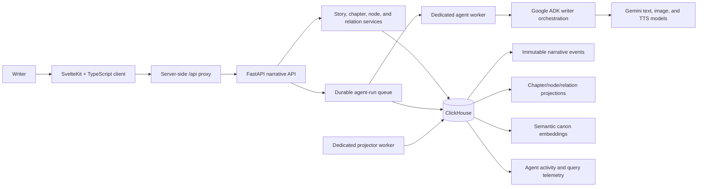

# CinemAgent 🎬🔍

> An AI-assisted narrative workspace where writers turn a vague draft into a living, production-ready story canon—and use that canon to write what comes next.

## Overview
**CinemAgent** is a modular, production-ready Agentic RAG system that transforms unstructured, vague story drafts into a structured **Knowledge Graph** stored in **ClickHouse**. Writers do not just need a model that continues text. They need a way to retain the characters, places, events, and visual ideas that accumulate while a story changes. CinemAgent makes that working memory visible as an editable narrative graph, proving how agents can simplify complex creative structures into production-ready artifacts.

**This is a prototype.** Gemini image and speech generation require an active Gemini key with available quota.

---

## 💡 Inspiration
A story rarely exists in one place. A writer may have a chapter draft, a note about a character's motivation, a contradictory description of a setting, and an idea for a later scene—all at once. The hard part is not only producing more prose; it is remembering what is already true, deciding what should become true, and seeing how a change affects the rest of the narrative.

Inspired by how difficult it is to maintain continuity in complex world-building, we wanted to create an intelligent co-author. Instead of just acting as a text-generation bot, we envisioned an agentic system that understands the *structure* of a story. CinemAgent treats a story as both text and a navigable canon. It is not a RAG demo with a graph attached; the graph is the writer's workspace.

---

## 🎮 What it does

### A two-panel narrative canvas
The client is a desktop-first SvelteKit application. The persistent left toolbar manages stories and AI tools. The main workspace has two coordinated panels:
- **Left panel:** The current story or chapter text, AI results, or the editable form for the selected graph item.
- **Right panel:** An interactive chapter timeline or focused narrative graph. 

### From Vague History to Structured Graph (Reviewable AI)
The writer can ask CinemAgent to extract graph proposals from vague chapter text. Proposals include meaningful names, descriptions, content, and relations so the result is not a collection of isolated labels. The writer can apply selected proposals or close the results without changing the canon. The AI makes proposals, but the writer remains the editor.

### Production artifacts from a chapter
CinemAgent can turn a chapter into production-oriented material:
- **Storyboards:** Identifies scenes and prepares image prompts grounded in characters and settings already in the chapter canon using Gemini.
- **Audio & Dialogue:** Extracts dialogue and narration from vague prose, generating tracks for speakers and narrators using TTS models.

---

## ⚙️ How it was built

### Tech Stack
- **Backend:** Python 3.11+, FastAPI, Pydantic, Google ADK
- **Frontend:** SvelteKit, TypeScript, Tailwind CSS, shadcn-svelte
- **Database/Storage:** ClickHouse (Vector Storage, Event Sourcing, Telemetry)
- **AI/Agents:** Gemini text, image, and TTS models, specialized story executors

### System Overview & Key Paradigms



#### Why ClickHouse?
ClickHouse is more than a database behind this project. It supports the narrative workflow in several ways:
- **Event-derived state:** Writer changes append to `narrative_event`. A checkpointed projector builds chapter, node, and relation read models.
- **Semantic canon:** Story material is embedded into `narrative_embedding`; semantic search uses vector distance to surface related canon.
- **Agent durability:** `agent_run`, stage, lease, and artifact data make long-running AI work inspectable and retryable.

#### Agent Orchestration and Writer Control
The API queues a writer-agent run, while a dedicated worker claims it with a durable lease. **Google ADK** orchestrates the complex `text-to-graph` and `graph-to-text` workflows. Specialized executors handle visual, voice, research, and production stages. 

---

## ⭐️ Accomplishments that we are proud of
1. **Structuring Creative Chaos:** Successfully building a workflow where a writer can move in both directions between vague prose and structured narrative knowledge.
2. **Interactive Graph UI:** The graph is not an abstract backend artifact; it is a navigable, editable part of the authoring interface with chapter context and visual differentiation.
3. **ClickHouse as the Ultimate Brain:** Leveraging ClickHouse for durable story events, projections, semantic canon retrieval, run history, and observability all at once.
4. **Durable Agent Architecture:** Building an agent layer that is durable and visible, making complex generation stages recoverable instead of tied to a single fragile browser request.

---

## 📚 What we learned
- **Inspectable AI is Better AI:** AI is most helpful to writers when it makes its reasoning inspectable and its changes reversible. Presenting graph proposals instead of silent text rewrites was a game-changer.
- **Context is King:** A story graph needs chapter-local relevance and global reuse. Either one alone makes the canon harder to work with.
- **Production Grounding:** Storyboards and narration are exponentially more useful when grounded in the chapter and its connected story facts, preventing hallucinations.

---

## 🚀 What's next for CinemAgent
1. **Collaboration:** Add collaboration, authorship, and review roles so a writing team can discuss and approve canon changes together.
2. **Expanded Export Workflows:** Expand export workflows from chapter production into screenplays, shot-lists, and writers-room formats.
3. **Advanced RAG Analytics:** Build evaluation datasets for extraction quality, relation coverage, and continuity findings to continuously improve the ADK workflows.
4. **Cloud Native Deployments:** Deploy API, projector, and agent workers independently with production observability and managed provider quotas.

---

## ⚠️ Instructions for Judges: Run locally

### Prerequisites
- Python 3.11 or newer
- Node.js 20+ and pnpm
- A ClickHouse instance (ClickHouse Cloud or local)
- A Gemini API key for Gemini-backed agents and media generation

### 1. Configure the API
Create a root `.env` file. Use your ClickHouse Cloud endpoint and credentials; do not commit this file.

```dotenv
PORT=8080
GEMINI_API_KEY=replace-with-your-gemini-key
NARRATIVE_API_KEY=choose-a-local-api-token

CLICKHOUSE_HOST=your-instance.clickhouse.cloud
CLICKHOUSE_PORT=8443
CLICKHOUSE_USER=default
CLICKHOUSE_PASSWORD=replace-with-your-clickhouse-password
CLICKHOUSE_SECURE=true

NARRATIVE_PROJECTOR_IN_PROCESS=false
NARRATIVE_AGENT_WORKER_IN_PROCESS=false
```

Create and activate a virtual environment, then install the server dependencies:
```powershell
python -m venv .venv
.\.venv\Scripts\Activate.ps1
pip install -r requirements.txt
```

Start the API, projector, and agent worker in three terminals with the environment activated:
```powershell
python -m uvicorn src.main:app --reload --port 8080
python -m src.narrative_projector
python -m src.narrative_agent_worker
```
> For a single-process local experiment, set both `NARRATIVE_PROJECTOR_IN_PROCESS=true` and `NARRATIVE_AGENT_WORKER_IN_PROCESS=true` and run only the API.

### 2. Configure and run the client
Create `client/.env` from `client/.env.example`:
```dotenv
FASTAPI_URL=http://localhost:8080
NARRATIVE_API_KEY=choose-a-local-api-token
```

Install and start the SvelteKit application:
```powershell
cd client
pnpm install
pnpm dev
```

Open the local URL printed by Vite (normally `http://localhost:5173`). Create a story, add a chapter, write a short scene, and run graph extraction to see the text-to-canon workflow!
