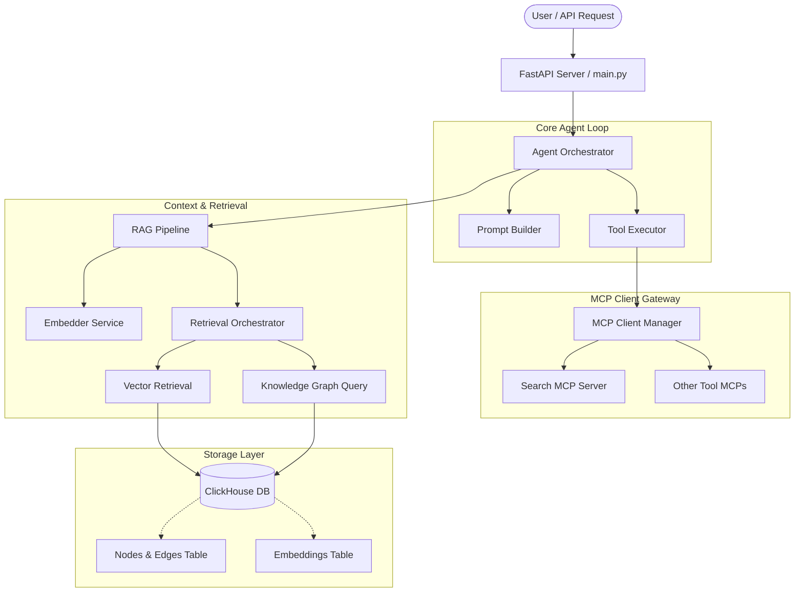

# CinemAgent 🎬🔍

A modular, production-ready Agentic RAG (Retrieval-Augmented Generation) system integrated with a **Knowledge Graph** stored in **ClickHouse** and parallelized client access to **Model Context Protocol (MCP)** servers, including a Search MCP. Designed for horizontal scalability and native deployment on Google Cloud Platform.

---

## 🏛️ System Architecture



---

## 📂 Repository Structure

The code is structured cleanly inside the `src/` directory to ensure clean packaging and simple dependency imports:

* **`src/agent/`**: The brain of the application. Contains the execution loop, prompts, tools binding, and planning logic.
* **`src/db/`**: Handles connectivity, schemas, migration, and raw client interface for **ClickHouse**.
* **`src/graph/`**: Manages entity/relationship ingestion, Graph RAG query construction, and graph traversal.
* **`src/mcp/`**: Implements the Model Context Protocol client to interact with external tools and search engines.
* **`src/rag/`**: Orchestrates text chunking, embedding generation, semantic search, and prompt context building.
* **`src/config.py`**: Validates and loads environmental configuration via Pydantic Settings.
* **`src/main.py`**: The application bootstrap file. Exposes a FastAPI application and background worker hooks.

---

## ⚙️ Configuration Variables

Configuration is loaded from environment variables or a local `.env` file. Key variables include:

| Environment Variable | Description | Default |
|----------------------|-------------|---------|
| `CLICKHOUSE_HOST` | Hostname of the ClickHouse server | `localhost` |
| `CLICKHOUSE_PORT` | Port of the ClickHouse server | `9000` |
| `CLICKHOUSE_USER` | Username for authentication | `default` |
| `CLICKHOUSE_PASSWORD` | Password for authentication | `""` |
| `CLICKHOUSE_DATABASE` | Database name for CinemAgent | `cinemagent` |
| `SEARCH_MCP_URL` | Endpoint of the Search MCP server | `http://localhost:8000` |
| `GCP_PROJECT_ID` | Google Cloud Project ID | `""` |
| `GCP_LOCATION` | Region for GCP deployment | `us-central1` |
| `GEMINI_API_KEY` | API Key for Gemini Models (Google GenAI) | `""` |
| `PORT` | Listening port for the application | `8080` |

---

## 🚀 Local Setup & Quickstart

### Prerequisites
- Python 3.11+
- [ClickHouse](https://clickhouse.com/) (either running locally or a Cloud instance)
- A running Search MCP server (or configure external MCP integrations)

### Installation

1. **Clone the repository:**
   ```bash
   git clone <repo-url> CinemAgent
   cd CinemAgent
   ```

2. **Create and activate a virtual environment:**
   ```bash
   python -m venv .venv
   # Windows:
   .venv\Scripts\activate
   # macOS/Linux:
   source .venv/bin/activate
   ```

3. **Install dependencies:**
   ```bash
   pip install -r requirements.txt
   ```

4. **Set up environment variables:**
   Create a `.env` file in the root directory:
   ```env
   GEMINI_API_KEY=your-gemini-api-key
   CLICKHOUSE_HOST=localhost
   CLICKHOUSE_PORT=9000
   CLICKHOUSE_DATABASE=cinemagent
   SEARCH_MCP_URL=http://localhost:5005
   ```

5. **Run the FastAPI server locally:**
   ```bash
   python src/main.py
   ```
   Access the interactive documentation (Swagger UI) at `http://localhost:8080/docs`.

---

## ☁️ Google Cloud Deployment

This repository is optimized for deployment to **Google Cloud Run** using Google Cloud Build.

### 1. Build and push image to Artifact Registry

Using Google Cloud Build, you can compile the image directly on the cloud:

```bash
gcloud builds submit --tag gcr.io/YOUR_PROJECT_ID/cinemagent:latest .
```

### 2. Deploy to Google Cloud Run

Deploy the image, passing the necessary environment variables:

```bash
gcloud run deploy cinemagent \
  --image gcr.io/YOUR_PROJECT_ID/cinemagent:latest \
  --platform managed \
  --region us-central1 \
  --allow-unauthenticated \
  --set-env-vars CLICKHOUSE_HOST=YOUR_CLICKHOUSE_HOST,CLICKHOUSE_PORT=YOUR_CLICKHOUSE_PORT,CLICKHOUSE_DATABASE=cinemagent
```

---

## 🔬 Core Components Deep Dive

### 📐 RAG and Knowledge Graph in ClickHouse
ClickHouse is utilized as a unified storage layer:
1. **Vector Storage**: Employs ClickHouse's high-performance vector search columns (`Array(Float32)`) combined with ANN indexes (e.g., `VectorSimilarity` index types) for semantic lookup.
2. **Knowledge Graph**: Stores Graph nodes and directed edges inside unified tables. Graph-RAG queries combine semantic vector search with multi-hop SQL JOINs to extract neighborhood entities and relationships.

### 🌐 Model Context Protocol (MCP) Integration
The MCP integration layer uses the standard protocol client pattern to connect dynamically to:
- A local or remote **Search MCP server** for real-time web querying and retrieval.
- Additional custom-configured MCP servers to hook in external toolkits.
