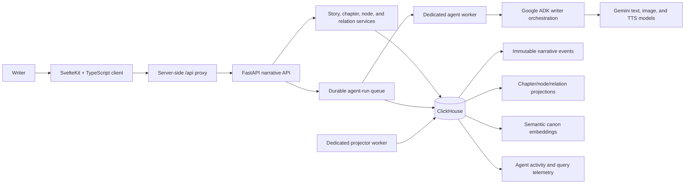

# CinemAgent

> An AI-assisted narrative workspace where writers turn a draft into a living story canon—and use that canon to write what comes next.

## tl;dr for judges

Writers do not just need a model that continues text. They need a way to retain the characters, places, events, assumptions, and visual ideas that accumulate while a story changes. CinemAgent makes that working memory visible as an editable narrative graph.

Write a chapter, ask AI to propose the graph it sees, review the proposed nodes and typed relations, and keep only what belongs in the story. Then navigate that canon to generate grounded chapter suggestions, continuity feedback, historical or lore research, storyboards, and narration. The writer remains the editor at every point.

**This is a prototype.** Gemini image and speech generation require an active Gemini key with available quota. CinemAgent reports provider failures instead of presenting placeholders as generated work.

## Demo

1. Create a story from the left toolbar and add a chapter.
2. Draft or paste chapter text in the writing panel.
3. Run **Extract graph proposals from chapter text** and review suggested characters, events, contexts, statements, and relations.
4. Apply selected suggestions. The right panel becomes a browsable, color-coded story graph; chapters form a timeline and graph nodes can be opened, edited, connected, and reused across chapters.
5. Select a chapter or node to focus the left panel. Use the canon to request prose suggestions, continuity feedback, research, storyboard scenes, or spoken dialogue and narration.

<!-- TODO: Add a real workspace overview screenshot: left editor/toolbar + right chapter timeline. -->
<!-- TODO: Add a real graph-proposal review screenshot. -->
<!-- TODO: Add a short demo-video link or GIF once one is recorded. -->

## Inspiration

A story rarely exists in one place. A writer may have a chapter draft, a note about a character's motivation, a contradictory description of a setting, and an idea for a later scene—all at once. The hard part is not only producing more prose; it is remembering what is already true, deciding what should become true, and seeing how a change affects the rest of the narrative.

CinemAgent treats a story as both text and a navigable canon. It is not a RAG demo with a graph attached. The graph is the writer's workspace: a shared model of story facts that can be inspected, corrected, connected to a chapter, and used to give AI enough context to be useful without taking authorship away.

## What it does

### A two-panel narrative canvas

The client is a desktop-first SvelteKit application. The persistent left toolbar manages stories and AI tools. The main workspace has two coordinated panels:

- **Left panel:** the current story or chapter text, AI results, or the editable form for the selected graph item.
- **Right panel:** an interactive chapter timeline or focused narrative graph. Breadcrumbs move between story, chapter, and node scopes. Nodes are draggable, have type-specific colors, and expose their name, content, description, and relationships.

A character created for Chapter 1 can be attached to Chapter 2 without being recreated. Chapter membership answers “where is this relevant?” while the story-scoped node answers “what is this in the canon?”

### Reviewable AI, not silent rewrites

The writer can ask CinemAgent to extract graph proposals from chapter text. Proposals include meaningful names, descriptions, content, and relations so the result is not a collection of isolated labels. The writer can apply selected proposals or close the results without changing the canon.

The reverse direction is equally important. Graph-aware suggestions use the current chapter plus the relevant canon to recommend additions or continuations to the draft. Continuity and research actions explain their findings in the results panel rather than making unreviewed changes.

### Production artifacts from a chapter

CinemAgent can also turn a chapter into production-oriented material:

- **Storyboards:** identifies scenes and prepares image prompts grounded in characters, settings, objects, and events already in the chapter canon. The writer selects which generated scenes to keep.
- **Audio:** separates labeled dialogue such as `[Mara]: We leave now.` from passive narration, then generates tracks for both speakers and narrator when the configured provider supports it.
- **Story/chapter production:** runs a contextual generation workflow that writes against the current narrative state instead of returning a fixed template.

## How it was built

### Tech stack

| Layer | Technologies | Role |
| --- | --- | --- |
| Writer client | SvelteKit, TypeScript, Tailwind CSS, shadcn-svelte, Tiptap, Svelte Flow | Two-panel writing workspace, forms, graph navigation, proposal review, and media results. |
| API | Python, FastAPI, Pydantic | Validated narrative graph and writer-workspace endpoints, authenticated server-side access, and OpenAPI documentation. |
| Agents | Google ADK, Gemini, specialized story/media executors | Text-to-graph extraction, graph-to-text drafting, research, visual planning, dialogue extraction, and narration. |
| Canon and intelligence | ClickHouse, clickhouse-connect | Story graph, event stream, projections, embeddings, semantic search, agent-run state, and query telemetry. |
| Media | Gemini image/TTS models, optional Edge/SAPI fallback | Chapter-aware storyboard generation and playable voice artifacts. |

### System overview



The browser never receives `NARRATIVE_API_KEY`. SvelteKit server routes forward `/api/graphs/...` requests to FastAPI and attach the server-only key.

### The narrative graph

The API models a story as a graph with chapters, reusable story-scoped nodes, chapter memberships, and typed relations. Nodes capture human-readable `name`, `content`, and `description`, not only technical metadata. Relations are explicit: their predicate expresses the writer's intended connection and can be inspected or changed from the canvas.

All graph writes use validated operations. This gives user-driven edits and AI proposals the same data path and lets the UI wait for materialization before treating a fact as canon.

### Why ClickHouse

ClickHouse is more than a database behind this project. It supports the narrative workflow in several ways:

- **Event-derived state:** writer changes append to `narrative_event`. A checkpointed projector builds chapter, node, relation, and membership read models, so the live workspace can read a current view while retaining history.
- **Semantic canon:** story material is embedded into `narrative_embedding`; semantic search uses vector distance to surface related canon within a story or chapter scope.
- **Agent durability:** `agent_run`, stage, lease, and artifact data make long-running AI work inspectable, retryable, and safe to process from a dedicated worker.
- **Observability:** query telemetry and materialized agent-run aggregates make the workload visible through workspace intelligence and diagnostics.

This design fits a writing tool particularly well: the same platform stores the current story state, its history, its semantic memory, and the operational record of the AI work performed on it.

### Agent orchestration and writer control

The API queues a writer-agent run, while a dedicated worker claims it with a durable lease and records each stage. Google ADK runs the text-to-graph and graph-to-text workflows; specialized executors handle visual, voice, research, and production stages. Runs expose progress, cancellation, retry, results, and artifacts to the client.

The important product decision is that agents propose and explain. A graph extraction does not automatically become canon, generated storyboard scenes are selected before storage, and writing suggestions are presented for the author to accept or reject.

## Challenges we ran into

### Keeping AI output useful without making it authoritative

Extracting entities is easy to demo but insufficient for a narrative workspace. We had to make proposals understandable—short names, useful descriptions, content, and relationships—and ensure they can be reviewed in context. The resulting workflow prioritizes reversible proposals over hidden graph mutations.

### Synchronizing a graph that changes while the writer works

Stories contain ordered chapters, reusable nodes, and cross-chapter relationships. The application uses story-scoped nodes with explicit chapter membership, event-derived read projections, and source revisions on agent runs so that delayed results can be identified against a changing draft.

### Making long-running media and agent work feel reliable

Generation can take longer than an ordinary form save. Dedicated workers, durable stages and leases, polling/streaming run state, loading indicators, and retry/cancel controls prevent the UI from behaving as if the work vanished. Media providers can fail because of quota or credentials; CinemAgent surfaces that failure rather than silently substituting fake output.

## Accomplishments we are proud of

- A writer can move in both directions between prose and structured narrative knowledge, while retaining the final editorial decision.
- The graph is not an abstract backend artifact: it is a navigable, editable part of the authoring interface with chapter context, typed relations, breadcrumbs, and visual differentiation.
- ClickHouse is used for operational and product value at once: durable story events, projections, semantic canon retrieval, run history, and observability.
- The agent layer is durable rather than tied to a single browser request, making generation stages visible and recoverable.

## What we learned

- AI is most helpful to writers when it makes its reasoning inspectable and its changes reversible.
- A story graph needs chapter-local relevance and global reuse; either one alone makes the canon harder to work with.
- Production-facing output benefits from the same canonical context as writing assistance. Storyboards and narration are more useful when they are grounded in the chapter and its connected story facts.
- Event history and semantic retrieval are complementary: one preserves how the canon changed, while the other helps find what is relevant now.

## What's next

- Add collaboration, authorship, and review roles so a writing team can discuss and approve canon changes together.
- Build evaluation datasets for extraction quality, relation coverage, continuity findings, and graph-grounded prose suggestions.
- Add richer source attribution from every generated result back to the chapter passages and canonical facts that informed it.
- Deploy API, projector, and agent workers independently with production observability and managed provider quotas.
- Expand export workflows from chapter production into screenplay, shot-list, and writer-room formats.

## Instructions for judges: run locally

### Prerequisites

- Python 3.11 or newer
- Node.js 20+ and pnpm
- A ClickHouse instance (ClickHouse Cloud or local)
- A Gemini API key for Gemini-backed agents and media generation

### 1. Configure the API

Create a root `.env` file. Use your ClickHouse Cloud endpoint and credentials; do not commit this file.

```dotenv
PORT=8080
GEMINI_API_KEY=replace-with-your-gemini-key
NARRATIVE_API_KEY=choose-a-local-api-token

CLICKHOUSE_HOST=your-instance.clickhouse.cloud
CLICKHOUSE_PORT=8443
CLICKHOUSE_USER=default
CLICKHOUSE_PASSWORD=replace-with-your-clickhouse-password
CLICKHOUSE_DATABASE=cinemagent
CLICKHOUSE_SECURE=true

NARRATIVE_PROJECTOR_IN_PROCESS=false
NARRATIVE_AGENT_WORKER_IN_PROCESS=false
```

Create and activate a virtual environment, then install the server dependencies:

```powershell
python -m venv .venv
.\.venv\Scripts\Activate.ps1
pip install -r requirements.txt
```

Start the API, projector, and agent worker in three terminals with the environment activated:

```powershell
python -m uvicorn src.main:app --reload --port 8080
python -m src.narrative_projector
python -m src.narrative_agent_worker
```

The API initializes ClickHouse schemas at startup. FastAPI's interactive endpoint reference is available at [http://localhost:8080/docs](http://localhost:8080/docs).

> For a single-process local experiment, set both `NARRATIVE_PROJECTOR_IN_PROCESS=true` and `NARRATIVE_AGENT_WORKER_IN_PROCESS=true` and run only the API. Use dedicated workers for the closer-to-production path above.

### 2. Configure and run the client

Create `client/.env` from `client/.env.example`:

```dotenv
FASTAPI_URL=http://localhost:8080
NARRATIVE_API_KEY=choose-a-local-api-token
```

Then install and start the SvelteKit application:

```powershell
cd client
pnpm install
pnpm dev
```

Open the local URL printed by Vite (normally [http://localhost:5173](http://localhost:5173)). Create a story, add a chapter, write a short scene, and run graph extraction to see the text-to-canon workflow.

### 3. Validate the project

```powershell
# From the repository root
python -m compileall -q src

# From client/
pnpm check
pnpm lint
pnpm test
```

## Built with

FastAPI · Pydantic · Python · SvelteKit · TypeScript · Tailwind CSS · shadcn-svelte · Tiptap · Svelte Flow · Google ADK · Gemini · ClickHouse · ClickHouse Cloud · Docker · Mermaid
